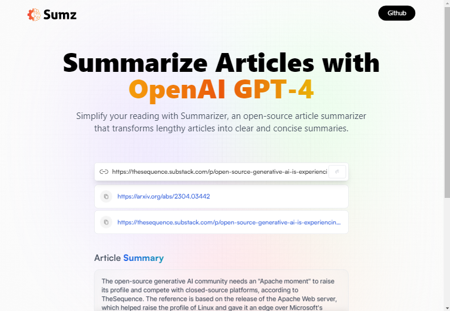

# PROJECT ARTICLE_SUMMARIZER



<!--  -->

React project designed to use OpenAI GPT-4 to generate summaries of the links pasted into it. The application makes use of several tools and libraries, including Tailwind CSS for styling, Redux-Toolkit for state management, and Antony's Article Extractor and Summarizer API for retrieving and summarizing articles. In addition to these tools, the project also uses Vite.

Vite is a build tool that provides fast and efficient development server and optimized building process for modern web applications. By utilizing Vite, this project is optimized for speed and efficiency during the development and building process.

The basic requirement for this React project is Node.js. Node.js is a JavaScript runtime built on Chrome's V8 JavaScript engine. It allows developers to run JavaScript on the server side, and also provides various tools and libraries for building scalable and efficient web applications. To run the project, you will need to have Node.js installed on your machine. You can download the latest LTS version of Node.js from the official Node.js [website](https://nodejs.org/en/download).

## Try it

Give it a go by visiting this [link](https://genuine-stroopwafel-d0ab6d.netlify.app/).

## Features

- Summarize articles from URLs using OpenAI's GPT-4.
- Save the summary you have made for individual articles.
- Copy the link of the summarized article for easy sharing.
- Revisit your previously summarized articles easily in the app

## Running the Application Locally

To run this application locally on your machine, follow these steps:

1. Clone the repository from GitHub onto your local machine.

```bash
git clone <repository URL>
cd <repository folder>
```

2. Run `npm install` to install all of the necessary dependencies.

```bash
npm install
```

3. Sign up for a RapidAPI account and obtain an API key for Antony's Article Extractor and Summarizer API [here](https://rapidapi.com/restyler/api/article-extractor-and-summarizer).
4. Create a file named .env at the root of the project directory and add your RapidAPI key to it as follows:
   VITE_RAPID_API_ARTICLE_KEY=your-key-goes-here
5. Run `npm start` to start the application on your local machine.

```bash
npm start
```

6. (optional) Run `npm run dev` This will start the Vite development server and the application will be available at http://127.0.0.1:5173/.

```bash
npm run dev
```

## Dependencies

This project relies on several third-party libraries and tools:

- [Tailwind CSS](https://tailwindcss.com/docs/guides/vite): a utility-first CSS framework for building custom designs quickly.
- [Redux-Toolkit](https://redux-toolkit.js.org/): a package of utilities for simplifying the creation of Redux stores.
- [Antony's Article Extractor and Summarizer API](https://rapidapi.com/restyler/api/article-extractor-and-summarizer): an API that retrieves and summarizes articles from URLs.
- Vite: a build tool that provides fast and efficient development and optimized building process for modern web applications.

## Notes

This project is currently in development and may be subject to change. Please report any bugs or issues to the project's GitHub repository.
